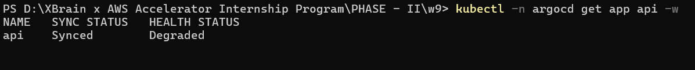
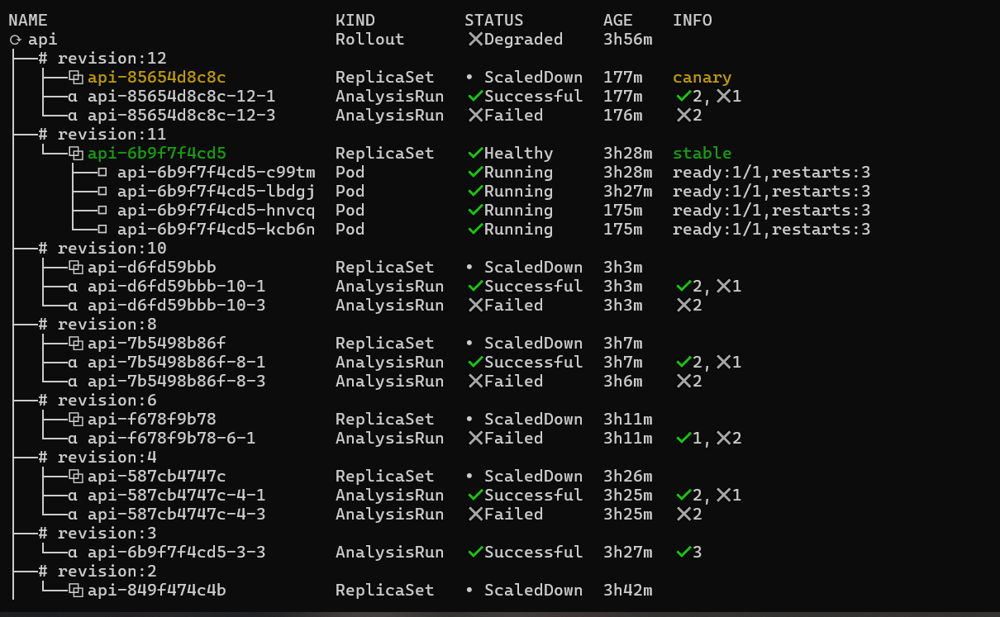
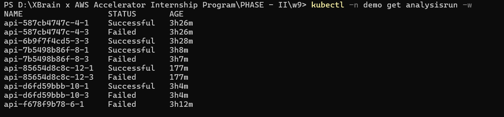
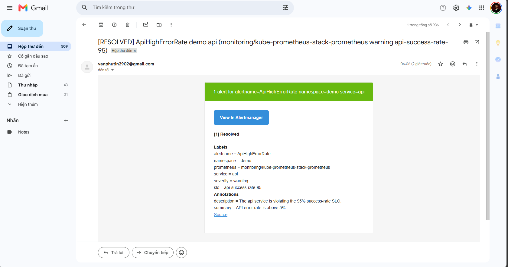

# GitOps Canary Rollout Lab

Repo nay minh hoa quy trinh GitOps cho app `api`:

1. ArgoCD doc manifest tu Git.
2. Argo Rollouts trien khai canary theo tung buoc.
3. Prometheus do error rate tu endpoint `/metrics`.
4. Neu error rate vuot nguong, Rollouts tu abort va giu ban stable cu.
5. PrometheusRule + AlertmanagerConfig dung de gui alert email khi SLO bi vi pham.

## Kien Truc

```text
GitHub repo
   |
   v
ArgoCD Application api
   |
   v
k8s-api/
   |-- api.yaml                 Rollout + Service
   |-- analysis-template.yaml   Query Prometheus de quyet dinh promote/abort
   |-- servicemonitor.yaml      Cho Prometheus scrape /metrics
   |-- prometheusrule.yaml      Alert khi error rate > 5%
   |-- alertmanagerconfig.yaml  Gui alert qua Gmail SMTP
```

## Canary Auto-Abort Hoat Dong Nhu The Nao?

Trong `k8s-api/api.yaml`, Rollout dung strategy canary:

```yaml
strategy:
  canary:
    steps:
      - setWeight: 25
      - analysis:
          templates:
            - templateName: api-error-rate
      - setWeight: 50
      - analysis:
          templates:
            - templateName: api-error-rate
      - setWeight: 100
```

Y nghia:

- `setWeight: 25`: chi dua mot phan traffic/pod sang ban moi.
- `analysis`: dung lai de do chat luong ban moi.
- Neu analysis pass, rollout di tiep len 50%, roi 100%.
- Neu analysis fail, rollout tu abort va giu ban stable cu.

Luong quyet dinh:

```text
Git push version moi
        |
        v
ArgoCD sync manifest
        |
        v
Rollouts dua canary len 25%
        |
        v
AnalysisTemplate query Prometheus
        |
        +-- error rate < 5%  --> promote tiep
        |
        +-- error rate >= 5% --> abort, rollback ve stable ReplicaSet
```

## Query Do Error Rate

Query trong `k8s-api/analysis-template.yaml`:

```promql
(
  sum(rate(flask_http_request_total{namespace="demo", status=~"5.."}[1m])) or vector(0)
)
/
clamp_min(
  sum(rate(flask_http_request_total{namespace="demo"}[1m])) or vector(0),
  0.001
)
```

Query nay tinh:

```text
error rate = request loi 5xx moi giay / tong request moi giay
```

Giai thich tung phan:

- `flask_http_request_total`: metric do `prometheus-flask-exporter` sinh ra.
- `status=~"5.."`: chi lay HTTP status code nhom 5xx, tuc loi server.
- `rate(...[1m])`: tinh toc do request trong cua so 1 phut gan nhat.
- `sum(...)`: cong request tu tat ca pod cua app.
- `or vector(0)`: neu chua co du lieu thi tra ve `0`, tranh query rong.
- `clamp_min(..., 0.001)`: tranh chia cho 0 khi app chua co traffic.

## Nguong Canary

Trong `AnalysisTemplate`:

```yaml
successCondition: result[0] < 0.05
interval: 20s
count: 3
failureLimit: 1
```

Y nghia:

- `0.05` tuong duong `5%` error rate.
- `result[0] < 0.05`: ban moi chi duoc xem la tot neu loi duoi 5%.
- `interval: 20s`: cu 20 giay do mot lan.
- `count: 3`: do toi da 3 lan.
- `failureLimit: 1`: neu fail qua 1 lan, analysis fail va rollout abort.

Noi theo SLO:

```text
Error rate < 5%
<=> Success rate > 95%
```

Neu ban moi co `ERROR_RATE=1`, app se tra loi rat nhieu. Khi do Prometheus do duoc error rate vuot 5%, AnalysisRun fail va Rollout tu abort.

## Alert Email

Trong `k8s-api/prometheusrule.yaml`, alert dung cung logic error rate:

```promql
(
  sum(rate(flask_http_request_total{namespace="demo", status=~"5.."}[1m])) or vector(0)
)
/
clamp_min(
  sum(rate(flask_http_request_total{namespace="demo"}[1m])) or vector(0),
  0.001
)
> 0.05
```

Khi error rate lon hon 5%, rule `ApiHighErrorRate` se fire:

```yaml
labels:
  namespace: demo
  severity: warning
  service: api
  slo: api-success-rate-95
```

Label `namespace: demo` rat quan trong vi AlertmanagerConfig trong namespace `demo` route alert theo namespace do.

## Lenh Tao Minh Chung

Mo 4 terminal de quay clip hoac chup anh.

Terminal 1: trang thai ArgoCD app.

```powershell
kubectl -n argocd get app api -w
```

Terminal 2: trang thai Rollout.

```powershell
kubectl argo rollouts get rollout api -n demo --watch
```

Neu plugin chua co trong `PATH`, dung truc tiep:

```powershell
& "$env:USERPROFILE\bin\kubectl-argo-rollouts.exe" get rollout api -n demo --watch
```

Terminal 3: trang thai AnalysisRun.

```powershell
kubectl -n demo get analysisrun -w
```

Terminal 4: traffic thuc te vao service `api`.

```powershell
kubectl -n demo delete pod load --ignore-not-found

kubectl -n demo run load --image=busybox --restart=Never -- `
  sh -c "while true; do wget -qO- api:8080/; sleep 1; done"

kubectl -n demo logs load -f
```

Sau do tao ban loi bang cach sua `k8s-api/api.yaml`:

```yaml
- name: ERROR_RATE
  value: "1"
- name: VERSION
  value: "v-bad"
```

Commit va push de ArgoCD tu sync:

```powershell
git add k8s-api/api.yaml
git commit -m "test canary auto abort"
git push
```

Ky vong khi demo:

```text
ArgoCD app api       Synced / Degraded
Rollout             Degraded, RolloutAborted
AnalysisRun         Failed
Stable ReplicaSet   van Healthy
Traffic             quay ve version stable
```

Sau khi quay clip/chup anh xong, revert commit test de tra Git ve trang thai tot:

```powershell
git revert HEAD --no-edit
git push

kubectl -n argocd annotate app api argocd.argoproj.io/refresh=hard --overwrite
kubectl -n argocd get app api -w
```

## Anh Minh Chung

ArgoCD nhan manifest tu Git, sync thanh cong nhung app `api` degraded vi Rollout abort ban loi:



Argo Rollouts giu stable ReplicaSet va danh dau canary revision bi failed:



AnalysisRun cho thay cac lan kiem tra Prometheus failed:



Email alert duoc gui qua Alertmanager/Gmail:



## Ket Luan

Canary o lab nay khong promote theo cam tinh. Ban moi phai vuot qua kiem tra dinh luong:

```text
error rate < 5%
```

Neu vuot nguong, Argo Rollouts tu abort. Vi toan bo thay doi di qua Git, rollback dung cach la `git revert`, sau do ArgoCD sync cluster ve trang thai mong muon.
